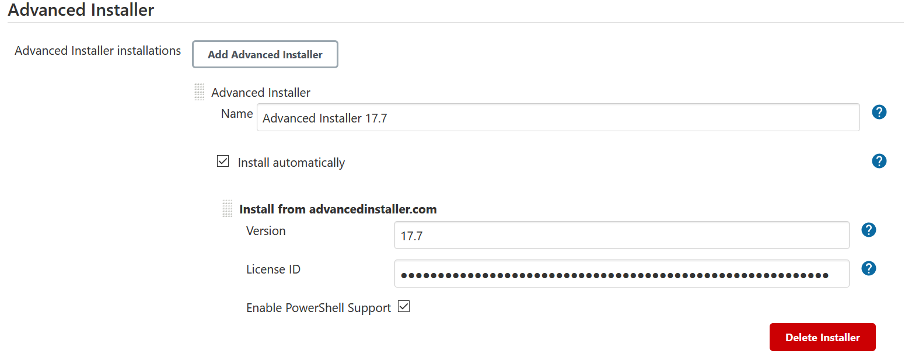
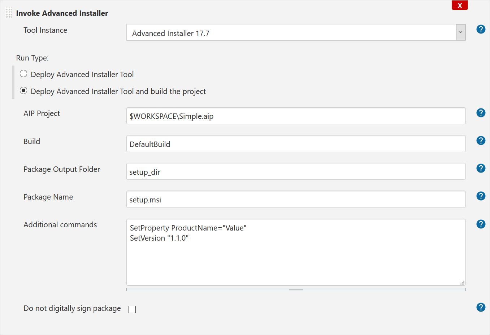

# Overview

Using this plugin you can easily integrate Advanced Installer into your
Jenkins build system. The output package can be any of the supported
packaging types supported by Advanced Installer, i.e. MSI, EXE, MSP,
MSM, APPV, etc. 

Advanced Installer is a Windows Installer authoring tool that can be
used to create installers for Windows, for desktop and web applications
(running on Windows servers). The [Advanced Installer command line
interface](http://www.advancedinstaller.com/user-guide/command-line.html)
 works with any automated build system. Also, it features a Visual
Studio extension, so you can create an Advanced Installer project and
build your installer directly from Visual Studio IDE. The VS extension
also integrates automatically with MSBuild, without requiring additional
configuration.

**Advanced Installer website**:
 [http://www.advancedinstaller.com](http://www.advancedinstaller.com/)

Please note that this plugin only works on Windows-driven Jenkins
installations.

# Prerequisites

1.  This plugin requires [Advanced
    Installer](https://www.advancedinstaller.com/). 
2.  JRE/JDK 1.7 or newer is also required for this plugin to work
    correctly. Older versions of the JDK have not been tested and might
    not work as expected.

# Tool Configuration

Before you can use it you need to configure an* Advanced
Installer installation.  *Here you have two options:

1.  Specify the root location where Advanced Installer already exists.
2.  Automatically install a new version
    from [advancedinstaller.com](https://www.advancedinstaller.com/version-history.html).
    You will need a  valid license key for registration, otherwise
    builds will fails or the generated setup packages will contains
    trial notification messages. If you are using the free edition of
    Advanced Installer, i.e. create only projects of type "Simple", a
    license is not required.



Job Configuration

Job configuration is easy, just enter the relative path to your AIP file
and set the desired options. For details about the different options,
please refer to the [Advanced Installer user
guide](http://www.advancedinstaller.com/user-guide/introduction.html).



# Use from Pipeline

### Just deploy

```
pipeline {
    agent { label 'windows' }
    stages {
        stage("build") {
            steps {
                script {
                    advinstBuilder(
                        installName: "Advinst 21.8.1",
                        advinstRunType: "deploy",
                    )
                }
            }
        }
    }
}
```
### Deploy and build AIP project

```
pipeline {
    agent { label 'windows' }
    stages {
        stage("build") {
            steps {
                script {
                    advinstBuilder(
                        installName: 'Advinst 21.8.1',
                        advinstRunType: 'build',
                        aipProjectPath: 'my_awesome_project.aip',
                        aipProjectBuild: 'MyBuild',
                        aipProjectOutputFolder: 'output',
                        aipProjectOutputName: 'MySetup',
                        aipProjectNoDigitalSignature: false,
                        advinstExtraCommands: 'SetVersion "1.1.1"'
                    )
                }
            }
        }
    }
}
```
# **Changelog**

The latest changes are documented on **[GitHub
Changelog](https://github.com/jenkinsci/advanced-installer-msi-builder-plugin/blob/master/CHANGELOG.md)**.

# Technical Support

Further information about Advanced Installer Plugin, including feature
requests or bug reports, you may contact us
on <http://www.advancedinstaller.com/forums/>.

 
